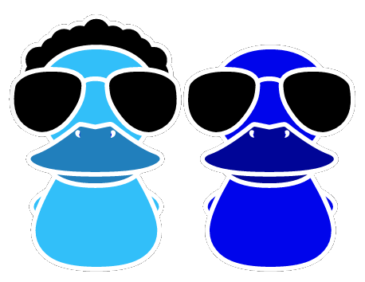
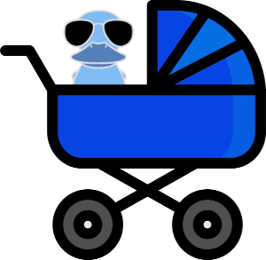

# cooldux

[](https://nodei.co/npm/cooldux/)

[](https://travis-ci.org/iceddev/cooldux) [](https://coveralls.io/r/iceddev/cooldux?branch=master)





Just a few helpers for the [redux](http://redux.js.org/) [ducks pattern](https://github.com/erikras/ducks-modular-redux)


## makeActionCreator

Since we're throwing actions and reducers into a single file, let's not bother with explicit constants:

```javascript

const somethingStart = cooldux.makeActionCreator();

// later something dispatches our action..
dispatch(somethingStart({foo: 'bar'}));

// and after that, our reducer can deal with action types as such:
export default function reducer(state = initialState, {type, payload}) {
  switch (type) {
    case somethingStart.type:
      return { ...state, foo: payload.foo };
    default:
      return state;
  }
}

```

## resetReducer

A reducer factory function that can handle a reset action and set the created reducer back to its initial state.

```javascript

const reducer = cooldux.resetReducer(initialState, function(state = initialState, action) {
  //cooldux resets are already handled!
  switch (action.type) {
    // the rest of your action types..
  }
});

//something dispatches a reset:
dispatch(cooldux.reset());


```


## promiseHandler

Async API calls with redux typically use 3 actions: a Start, End, and Error.

If you're using Promises, `cooldux.promiseHandler` wraps this all up for you and automatically dispatches the correct actions:

```javascript

const { exampleStart, exampleEnd, exampleError, exampleHandler } = promiseHandler('example');

//your redux-thunk action creator
export function fetchData() {
  return function dispatcher(dispatch) {
      const promise = somePromiseAPI();
      return exampleHandler(promise, dispatch);
  };
}

//your reducer can use the action types returned above with promiseHandler
export default function reducer(state = initialState, { payload, type }) {
  switch (type) {
    case exampleStart.type:
      return { ...state, examplePending: true, exampleError: null };
    case exampleEnd.type:
      return { ...state, examplePending: false, exampleError: null, example: payload };
    case exampleError.type:
      return { ...state, examplePending: false, exampleError: payload };
    default:
      return state;
  }
}


```

If you follow the cooldux naming conventions, you can further remove boiler plate code using the `cooldux.promiseHandler`'s reducer:

```javascript

const { exampleHandler, exampleReducer } = promiseHandler('example');

//your redux-thunk action creator
export function fetchData() {
  return function dispatcher(dispatch) {
      const promise = somePromiseAPI();
      return exampleHandler(promise, dispatch);
  };
}

//this will automatically modify state in the same way as the previous example
export default exampleReducer;

```

## combinedHandler


If you have multiple parts of the state you'd like to manage with cooldux in a single file, you can even further remove boiler plate code using the `cooldux.combinedHandler`'s function:

```javascript

const { exampleAHandler,
        exampleBHandler,
        initialStateCombined,
        reducerCombined
       } = combinedHandler(['exampleA', 'exampleB']);


export function exampleA() {
  return function dispatcher(dispatch) {
      const promise = somePromiseAPI();
      return exampleAHandler(promise, dispatch);
  };
}

export function exampleB() {
  return function dispatcher(dispatch) {
      const promise = somePromiseOtherAPI();
      return exampleBHandler(promise, dispatch);
  };
}

//this will run through all the reducers created
export default reducerCombined;

```


## promiseMiddleware

You can optionally add the cooldux promise-aware middleware to redux to automatically handle dispatching the different parts of an asynchronous call.

Just apply promiseMiddleware:

```javascript
import { promiseMiddleware } from 'cooldux';
const store = createStore(reducers, applyMiddleware(promiseMiddleware));

```

Now this lets us shorten our previous example by not having to pass around the dispatch function normally required by redux-thunk:

```javascript

const { exampleAAction,
        exampleBAction,
        reducerCombined
       } = combinedHandler(['exampleA', 'exampleB']);

export const exampleA = () => exampleAAction(somePromiseAPI());
export const exampleB = ipnut => exampleBAction(someSyncAPI(input));

export default reducerCombined;

```

## makeDuck



Now that we're using middleware, can we make the above example even more automatic?  
Of course!

In cases where you just want to provide functions and let cooldux manage the actions, dispatching, and the reducer, you can provide `cooldux.makeDuck` with a map of those functions. 

```javascript

const duck = makeDuck({
  exmapleA : somePromiseAPI,
  exampleB : input => someSyncAPI(input)
});

export const { exampleA, exampleB } = duck;
export default duck.reducerCombined;

```

That's your entire state handler for a couple of functions that can by synchronous or promise-returing!  Your react or whatever view can just look in redux for `props.someState.exampleA` or `props.someState.exampleAError`.  


## cache

Sometimes you only want to do an action once. For example only fetch data from an API if you haven't already.  `makeDuck` and `promiseHandler` can take an option to return actions that will check state and only call your action if needed.

```javascript

const duck = makeDuck({
  exmapleA : somePromiseAPI
}, {namespace: 'foo', cache: true});

export const { exampleA, exampleACached } = duck;
export default duck.reducerCombined;

```

In this example if you call `exampleACached` the cooldux middleware will check the state for `foo.exampleA` and if it sees a value return that, otherwise call the `exampleA` function.  **Your namespace must be the as the property this duck belongs to.**


## That's it for now!

Each of the previous examples build on eachother, you certainly don't need to use all of the cooldux functions. It might be that just the early examples feel helpful or it may be that you're on board to use it all and just let the automagic take you.