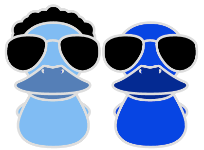

# cooldux

[](https://nodei.co/npm/cooldux/)
[](https://travis-ci.org/iceddev/cooldux) [](https://coveralls.io/r/iceddev/cooldux?branch=master)





Just a few very simple helpers for the [redux](http://redux.js.org/) [ducks pattern](https://github.com/erikras/ducks-modular-redux)


## makeActionCreator

Since we're throwing actions and reducers into a single file, let's not bother with explicit constants:

```javascript

const somethingStart = cooldux.makeActionCreator('example-SOMETHING_START');

// later something dispatches our action..
dispatch(somethingStart({foo: 'bar'}));

// and after that, our reducer can deal with action types as such:
export default function reducer(state = initialState, action) {
  switch (action.type) {
    case somethingStart.type:
      return { ...state, foo: payload.foo };
    default:
      return state;
  }
}

```

## resetReducer

A reducer factory function that can handle a reset action and set the created reducer back to its initial state.

```javascript

const reducer = cooldux.resetReducer(initialState, function(state = initialState, action) {
  //cooldux resets are already handled!
  switch (action.type) {
    // the rest of your action types..
  }
});

//something dispatches a reset:
dispatch(cooldux.reset());


```


## promiseHandler

Async API calls with redux typically use 3 actions: a Start, End, and Error.

If you're using Promises, `cooldux.promiseHandler` wraps this all up for you and automatically dispatches the correct actions:

```javascript

const { exampleStart, exampleEnd, exampleError, exampleHandler } = promiseHandler('example');

//your redux-thunk action creator
export function fetchData() {
  return function dispatcher(dispatch) {
      const promise = somePromiseAPI();
      return exampleHandler(promise, dispatch);
  };
}

//your reducer can use the action types returned above with promiseHandler
export default function reducer(state = initialState, { payload, type }) {
  switch (type) {
    case exampleStart.type:
      return { ...state, examplePending: true, exampleError: null };
    case exampleEnd.type:
      return { ...state, examplePending: false, exampleError: null, example: payload };
    case exampleError.type:
      return { ...state, examplePending: false, exampleError: payload };
    default:
      return state;
  }
}


```

If you follow the cooldux naming conventions, you can further remove boiler plate code using the `cooldux.promiseHandler`'s reducer:

```javascript

const { exampleHandler, exampleReducer } = promiseHandler('example');

//your redux-thunk action creator
export function fetchData() {
  return function dispatcher(dispatch) {
      const promise = somePromiseAPI();
      return exampleHandler(promise, dispatch);
  };
}

//this will automatically modify state in the same way as the previous example
export default exampleReducer;

```
